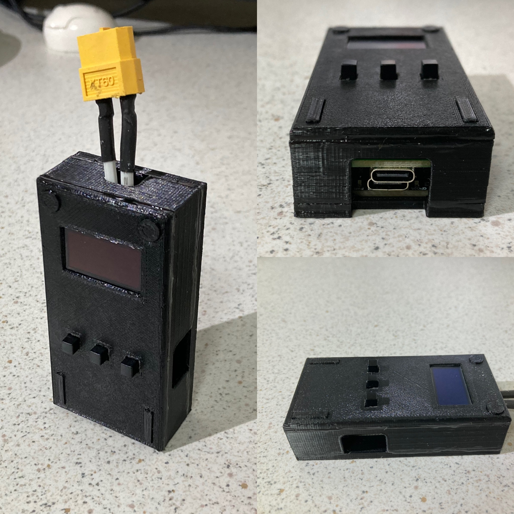

# Tiny Programmable Power Supply

今は、USB機器向けのACアダプタやモバイルバッテリーは、一人一つ以上持っていると思います。最近では、そういった機器は、USB PD-PPSに対応していることが多く、USB PD-PPSとは、Power Delivery - Programmable Power Supplyと言う通り、電圧電流がプログラム可能な電源機能を持っていることを表しています。  

このリポジトリは、そのUSB PD PPSの機能を使った小型の可変電圧電源を作ることを目的としています。  

そして、同じような目的に使える素晴らしい製品がすでにありますので、興味のある人は、以下のリンクを参照ください。  
https://hackaday.io/project/192576-picopd-usb-c-pd-30-pps-trigger-with-rp2040

上記のものが日本では入手し難かったのと、単純に作りたかったため始めたプロジェクトです。

## Prototype 1.0

### ・外観

### ・主要部品
- [AP33772使用 USB PD PPSコントローラー基板](https://aselectroworks.booth.pm/items/5621735)  
- Raspberry Pi Pico（代替品を使用）  
- [0.96インチ 128×64ドット有機ELディスプレイ(OLED) 白色](https://akizukidenshi.com/catalog/g/g112031/)  
- [タクトスイッチ](https://akizukidenshi.com/catalog/g/g112224)、[キートップ](https://akizukidenshi.com/catalog/g/g112429/)  
- パワーMOSFET IRFZ44N  
- コンデンサ  

出力のON/OFF回路部にパワーMOSFET、コンデンサを使用していますが、知識が乏しく適切な使用じゃないかもしれません。

### ・仕様
| 項目 | 数値 |
|-----|-----|
| 電圧範囲 | 3.3 - 21.0V 20mV刻み |
| 電流範囲 | 最大5A 50mA刻み |
|  | ※USB PD 3.0仕様の範囲、実際の使用時は電源ソースの能力による |
| 大きさ | 80 x 40 x 21mm |
| 重さ | 52g |
| 入出力 | 3ボタン、128x64 OLED、USB-C(電源ソース、プログラム)、XT60コネクタ(電力出力) |

### ・リンク
[ファームウェア](proto1/software/firmware/)  
[配線図](proto1/hardware/circuit/tiny_pps_proto1_bb.png)  
[ケースの3Dプリントモデル](proto1/hardware/3d-printed-case/)  
